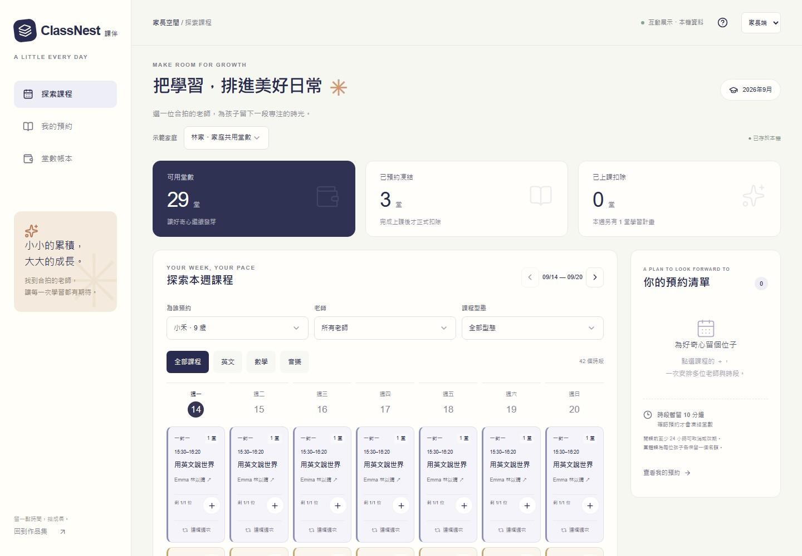

# Yorke Hsu — Portfolio

個人作品集網站，聚焦互動前端、產品系統與流程自動化。收錄 **10 件可操作作品**，從品牌體驗、課程與訂單管理，到 3D 標註、資料蒐集及瀏覽器巡檢，搭配實際畫面縮圖與前台、老師端、管理台和工具下載入口。

[瀏覽作品集](https://tamyu321-source.github.io/isle-scent-taiwan-studio/#work) · [ClassNest 課伴](https://tamyu321-source.github.io/isle-scent-taiwan-studio/classnest/) · [CHECKPOINT 驗收報告](https://tamyu321-source.github.io/isle-scent-taiwan-studio/checkpoint/) · [GitHub Actions](https://github.com/tamyu321-source/isle-scent-taiwan-studio/actions/workflows/pages.yml)

## 十件互動作品

| 展示順序 | 作品與入口 | 分類 | 功能與延伸入口 |
| --- | --- | --- | --- |
| 01 | [ClassNest 課伴](https://tamyu321-source.github.io/isle-scent-taiwan-studio/classnest/) | 應用系統 | 多老師預約、限時保留、堂數帳本；[老師端](https://tamyu321-source.github.io/isle-scent-taiwan-studio/classnest/teacher/)、[管理端](https://tamyu321-source.github.io/isle-scent-taiwan-studio/classnest/admin/) |
| 02 | [VECTOR](https://tamyu321-source.github.io/isle-scent-taiwan-studio/vector/) | 自動化工具 | Three.js 點雲、3D 標註、品質覆核、任務與資料匯出 |
| 03 | [Isle / Scent](https://tamyu321-source.github.io/isle-scent-taiwan-studio/isle-scent/) | 品牌網站 | 香氛品牌、Canvas 動態敘事；[產品詳情](https://tamyu321-source.github.io/isle-scent-taiwan-studio/collections/o-01/)、[案例說明](https://tamyu321-source.github.io/isle-scent-taiwan-studio/work/isle-scent/) |
| 04 | [PURE WHITE](https://tamyu321-source.github.io/isle-scent-taiwan-studio/pure-white/) | 品牌網站 | 希臘優格品牌、規格選擇、捲動分鏡與食譜；[產品詳情](https://tamyu321-source.github.io/isle-scent-taiwan-studio/pure-white/original/) |
| 05 | [豬仔仔幼兒園](https://tamyu321-source.github.io/isle-scent-taiwan-studio/piglet-daycare/) | 應用系統 | 狗狗貓貓寄宿、預約、客戶、費用與相簿；[管理台](https://tamyu321-source.github.io/isle-scent-taiwan-studio/piglet-daycare/admin/) |
| 06 | [Order Flow](https://tamyu321-source.github.io/isle-scent-taiwan-studio/order-hub/) | 應用系統 | 專屬下單連結、採購、庫存與出貨；[管理台](https://tamyu321-source.github.io/isle-scent-taiwan-studio/order-hub/admin/) |
| 07 | [MORI 留白陶作](https://tamyu321-source.github.io/isle-scent-taiwan-studio/mori-studio/) | 應用系統 | 陶作體驗、名額、選物與模擬結帳；[管理台](https://tamyu321-source.github.io/isle-scent-taiwan-studio/mori-studio/admin/)、[會員空間](https://tamyu321-source.github.io/isle-scent-taiwan-studio/mori-studio/member/) |
| 08 | [ShareFlow](https://tamyu321-source.github.io/isle-scent-taiwan-studio/shareflow/) | 應用系統 | 廣告收入、分潤試算與結算紀錄；[管理台](https://tamyu321-source.github.io/isle-scent-taiwan-studio/shareflow/admin/) |
| 09 | [FIELDWORK](https://tamyu321-source.github.io/isle-scent-taiwan-studio/fieldwork/) | 自動化工具 | 公開商家資料蒐集、來源核對、CSV／JSON；[下載 Python 工具](https://tamyu321-source.github.io/isle-scent-taiwan-studio/downloads/fieldwork-python.zip) |
| 10 | [CHECKPOINT](https://tamyu321-source.github.io/isle-scent-taiwan-studio/checkpoint/) | 自動化工具 | 真實瀏覽器操作、截圖、下載與發佈檢查；[下載巡檢工具](https://tamyu321-source.github.io/isle-scent-taiwan-studio/downloads/checkpoint-python.zip) |

作品分類為「全部 10／品牌網站 2／應用系統 5／自動化工具 3」。桌面 ≥1100px 三欄、700–1099px 兩欄、手機單欄；每張卡片保留縮圖、標題、兩行簡介、技術標籤與入口，不再使用跨整列的大卡片。

畫面編號依展示順序產生，既有 `project-01` 至 `project-09` 錨點保留；ClassNest 使用 `project-10` 並置於首位。直接開啟作品錨點會顯示全部分類，讓目標作品保持可見。作品資料與分類實作位於 [components/portfolio-works.tsx](components/portfolio-works.tsx)。

## ClassNest 課伴

對應案件 **TK26082812OCYG11** 的課程預訂概念作品。奶油白、深靛藍與杏橘配色，桌面提供每週課表及預約清單，手機使用日期切換、每日課程清單與底部操作列。



### 操作流程

1. **家長選課：**切換示範家庭及孩子，依科目、老師、日期、課程型態篩選。一對一與團體課皆有名額與固定扣堂數，可跨老師多選，或安排連續 2–8 週。
2. **保留與預約：**選取後保留名額 10 分鐘並顯示倒數，取消或逾時釋放。暫留不扣堂；確認時重新檢查名額、孩子撞課及餘額，整批成功才成立並凍結家庭共用堂數。
3. **取消與改期：**開課前至少 24 小時可按單堂操作。改期在同一筆交易完成新課確認與舊課釋放，失敗時保留原預約。
4. **老師點名：**老師查看自己的課表和團體名單，在課程結束後標記出席或缺席；兩者皆依原定堂數結算，重複點名不重複扣堂。
5. **教務管理：**新增或編輯可調整的時段、團體容量及扣堂規則；已有預約的課程不能直接改動。停課釋放凍結堂數，人工補退堂必填原因。
6. **紀錄查詢：**查詢預約與堂數帳本，下載 CSV；正負堂數保留為數值，可在試算表加總。重設示範只影響 ClassNest。

預設包含英文、數學、音樂、6 位老師與兩個多孩家庭，涵蓋一對一、團體課、額滿及待點名情境。時間採 `Asia/Taipei`；載入時補足台北當週起 12 週的場次，保留歷史預約與帳本。

### 資料與交易設計

- [lib/classnest-domain.ts](lib/classnest-domain.ts)：家庭、孩子、老師、場次、暫留、預約及帳本獨立型別；領域函式接受明確時鐘，與畫面分離。
- [lib/classnest-store.ts](lib/classnest-store.ts)：IndexedDB 獨立資料庫。讀取最新狀態、檢查名額、寫入預約與堂數異動均在同一筆交易完成，提交成功才顯示成功。
- BroadcastChannel 通知同瀏覽器其他分頁重新讀取。唯一操作識別碼及狀態驗證避免重複預約、點名或退堂。
- 可用、凍結、已扣堂數由帳本加總；每次變更核對餘額與預約的一致性。讀寫失敗顯示可重試的錯誤，不清除既有資料或假報成功。

完整說明見 [ClassNest 操作、架構與驗證](docs/classnest.md)。

## 展示資料與範圍

本專案使用 GitHub Pages 靜態託管。管理台與角色選擇用於展示介面及流程，**不是正式登入或多用戶後端**。沒有真實付款、扣款、寄信、視訊教室、原生 App 安裝包或外部通知。

| 作品 | 資料與體驗方式 |
| --- | --- |
| ClassNest | IndexedDB 保存虛構家庭、預約與堂數；同瀏覽器、同網站來源的分頁可同步，不跨裝置。家長／老師／管理員直接切換。 |
| 豬仔仔幼兒園、Order Flow | 展示資料存在目前瀏覽器。示範管理帳號分別為 `admin / piglet2026`、`admin / order2026`。 |
| MORI | 示範會員、體驗預約與選物訂單；取消會回補庫存及席次，既有訂單保留成交價。 |
| ShareFlow | 當前頁面的分潤與權限流程示範，未串接真實廣告帳戶或正式身分驗證。 |
| VECTOR | 合成點雲、物件與軌跡，本機保存標註；未連接真實駕駛資料、AI 推論或團隊同步服務。 |
| FIELDWORK | 讀取發佈時蒐集的公開商家資料，保留來源與擷取狀態；資料核對不等同電話確認或營業保證。 |
| CHECKPOINT | 發佈產物附帶實際瀏覽器執行報告；網頁不會啟動訪客電腦的程式。本機工具使用獨立瀏覽器環境。 |
| Isle / Scent、PURE WHITE | 原創品牌概念及生成影像；產品規格與配方不代表上市商品，無實際訂購功能或健康功效宣稱。 |

清除網站資料會移除本機展示紀錄。正式營運需另接共用資料庫、伺服器端交易、身分與權限驗證；ClassNest 亦需可信任的伺服器時間。

## 技術與專案結構

React 19 / TypeScript / Vinext / Vite / Tailwind CSS 4 / Base UI / Three.js / Canvas 2D / IndexedDB / Python / Playwright。

| 目錄 | 用途 |
| --- | --- |
| `app/` | 作品集、作品前台與各角色路由；目前靜態建置輸出 34 個路由 |
| `components/` | 共用 UI、各作品互動元件與作品卡片 |
| `lib/`、`hooks/` | 領域模型、資料驗證、瀏覽器保存與狀態邏輯 |
| `public/images/`、`public/downloads/` | 圖片、實際畫面縮圖與可下載工具 |
| `tools/fieldwork/`、`tools/checkpoint/` | 可在 Windows 執行的 Python 工具與測試 |
| `tests/`、`scripts/` | 模型測試、打包、靜態路由準備及瀏覽器發佈檢查 |
| `docs/` | 各作品的架構、設計與驗收說明 |

Isle / Scent 使用 Canvas 逐幀影格、`IntersectionObserver` 與 `requestAnimationFrame` 呈現多鏡位敘事；PURE WHITE 提供捲動分鏡及可保留的規格選擇。兩者均尊重 `prefers-reduced-motion`。VECTOR 將 Three.js 渲染與 React 介面狀態分離，提供選取、拖曳、框選與軌跡播放。

歷史案例路由保留：[桌面財務系統](https://tamyu321-source.github.io/isle-scent-taiwan-studio/work/ledger-flow/)、[交易自動化](https://tamyu321-source.github.io/isle-scent-taiwan-studio/work/signal-desk/)、[瀏覽器流程自動化](https://tamyu321-source.github.io/isle-scent-taiwan-studio/work/tax-flow/)。它們不列入十件互動作品的編號。

## 本機開發

建議 Node.js 24，專案要求 ≥22.13。以下指令在儲存庫根目錄執行：

```powershell
npm ci
npm run dev
# http://localhost:5173/
```

若使用 Volta，可將命令前置 `volta run --node 24.11.1`。瀏覽器巡檢另外需要 Python 3.11、Playwright 與 Chromium：

```powershell
py -3.11 -m venv .sites-runtime/checkpoint-venv
.\.sites-runtime\checkpoint-venv\Scripts\python.exe -m pip install -r tools/checkpoint/requirements.txt
.\.sites-runtime\checkpoint-venv\Scripts\python.exe -m playwright install chromium
```

## 驗證

```powershell
# 型別、模型及報告格式
npx tsc --noEmit
node --experimental-strip-types --test tests/classnest.test.mjs tests/vector.test.mjs
node --test tests/fieldwork.test.mjs tests/checkpoint.test.mjs
node scripts/check-mori.mjs
py -3.11 -X utf8 -m unittest discover -s tools/fieldwork -p "test_*.py" -v
.\.sites-runtime\checkpoint-venv\Scripts\python.exe -X utf8 -m unittest discover -s tools/checkpoint -p "test_*.py" -v

# 另開終端保持 npm run dev；執行 ClassNest 操作與響應式驗收
.\.sites-runtime\checkpoint-venv\Scripts\python.exe -X utf8 tools/checkpoint/classnest_qa.py --base http://localhost:5173/ --output outputs/classnest-qa
```

- ClassNest：16 組規則測試，涵蓋最後名額、跨老師撞課、批次回滾、堂數不足、暫留到期、重複確認／點名、24 小時取消邊界、改期失敗保留原課、停課與人工補堂。
- 既有檢查：VECTOR 5 組、FIELDWORK 與 CHECKPOINT 共 10 組 Node 測試，另有兩套 Python 工具測試及 MORI 流程檢查。
- ClassNest 瀏覽器流程：跨角色、重新整理、雙分頁名額競爭、實際 CSV 下載與加總、鍵盤操作、讀寫錯誤與重試。
- 響應式驗收：ClassNest 三個角色入口及作品集，於 320／390／768／1440px 共 16 種組合檢查水平溢出，保存桌面與手機截圖。加入 `--thumbnail` 可從實際畫面更新 ClassNest 縮圖。
- 發佈檢查：作品集、PURE WHITE、FIELDWORK、ClassNest 各測桌面及手機，**8 個案例全部通過**才可部署。報告區分通過、失敗、受阻及未執行。

## GitHub Pages 發佈

目前只維護 GitHub Pages，既有 Sites 不再同步發佈。[pages.yml](.github/workflows/pages.yml) 在推送 `main`、手動執行及每日排程時執行測試、更新 FIELDWORK 公開資料、打包工具、靜態建置及 CHECKPOINT 驗收。排程預定台灣時間 08:17，實際時間以 Actions 為準。

所有路由與資源支援 `/isle-scent-taiwan-studio/` 子路徑。`scripts/prepare-github-pages.mjs` 依 HTML 產物建立含尾斜線的深層入口，發佈目錄為 `dist/client`。本機重現 Pages 建置及完整瀏覽器門檻：

```powershell
$env:GITHUB_ACTIONS = 'true'
$env:GITHUB_REPOSITORY = 'tamyu321-source/isle-scent-taiwan-studio'
npm run build
node scripts/prepare-github-pages.mjs
node scripts/run-checkpoint.mjs --python .sites-runtime/checkpoint-venv/Scripts/python.exe
# 完成後在目前終端清除測試用環境變數
Remove-Item Env:GITHUB_ACTIONS
Remove-Item Env:GITHUB_REPOSITORY
```

CHECKPOINT 對本次靜態產物啟動暫時伺服器，全部通過後將 HTML／JSON 報告與截圖放入 `dist/client/data/checkpoint/latest/` 一起發佈。失敗時保留原線上版本，診斷 artifact 保留 7 天。發佈驗收需核對本次提交的 Actions 結果與公開入口，不能將本機建置成功視為線上更新成功。

## 延伸文件

- [ClassNest：操作、交易設計與驗證](docs/classnest.md)
- [VECTOR：標註流程與資料範圍](docs/vector-perception.md) · [驗證紀錄](docs/vector-validation.md)
- [FIELDWORK：工具操作與資料來源](tools/fieldwork/README.md) · [驗收說明](docs/fieldwork-acceptance.md)
- [CHECKPOINT：Windows 工具操作與報告](tools/checkpoint/README.md) · [驗收說明](docs/checkpoint-acceptance.md)
- [PURE WHITE：影像設計](docs/pure-white-art-direction.md) · [食譜內容](docs/pure-white-recipes.md) · [驗收說明](docs/pure-white-acceptance.md)
